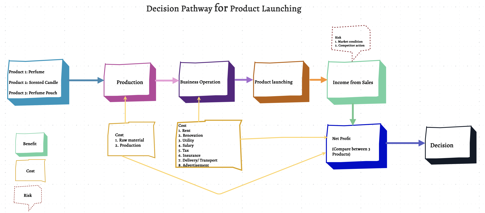
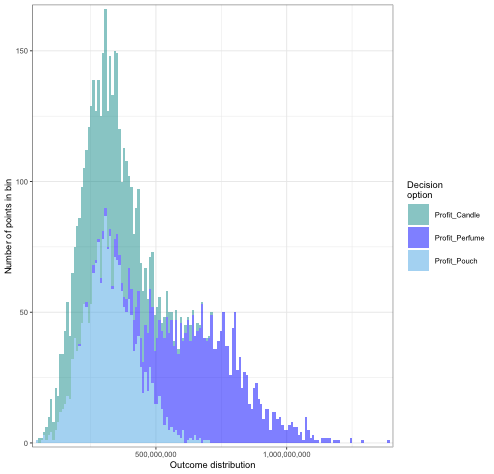
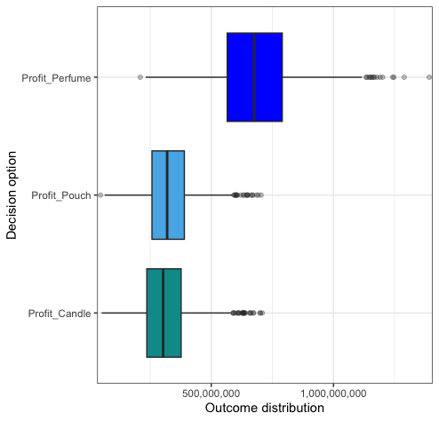
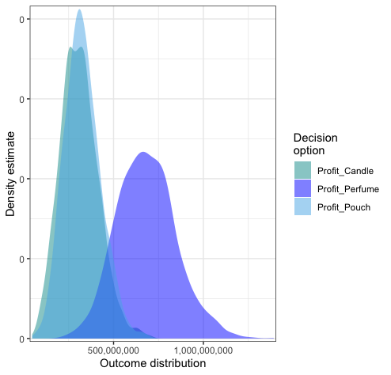
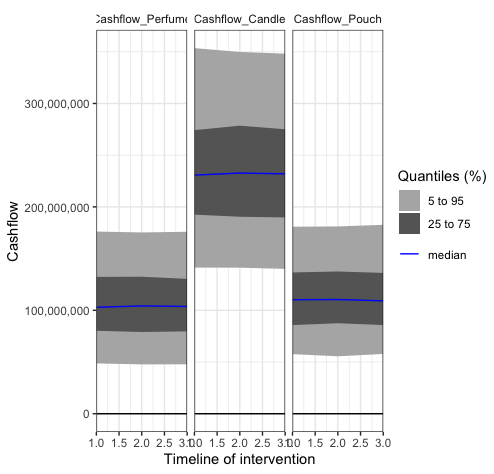
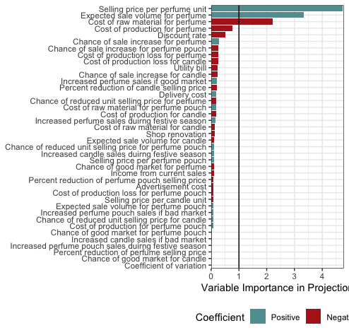

```{r setup, include=FALSE}
knitr::opts_chunk$set(echo = TRUE)
library(decisionSupport)
library(knitr)
library(readr)
```

# Forecasting the Outcomes of A New Product Launch Using Monte Carlo Simulation

*A simulation practice by SM*

## Background information

> A fragrance retailer planned to launch a new product to boost sale. The product development
team proposed three product ideas: perfume, scented candle and Chinese perfume pouch.The sale department
gathered data from market surveys, and forcasted sales for three proposed products, using the Monte Carlo (MC) Simulation method. 

> Based on the outcomes of the simulation, the product with the best simulation result was chosen for the product line. 

## Building the model

> The first step to decision analysis using MC simulation was buidling the conceptual model. The model was built  based on the information gathered from market surveys and experts' opinions. 



> The model shows the pathway for decision analysis, and outlines benefits, costs and risks that can impact decision making. 

## Building the input table

> Next, an input table was made based on the variables outlined in the conceptual model. 

``` {r save}
df<- read.csv("Input_perfume.csv")
knitr::kable(df)
```

## Linking the varibles in R

> The net profit for each product was calculated and compared using R program software. The net profit was calculated using the formula: **Net Profit = Sales Volume * (Selling Price - Unit Cost) _ Fixed Costs**

> However, the input variables must be strung together first before fitting into the formula. 

> First, annual costs for rent, utility, delivery or transport, salary, insurance, renovation or decoration and advertisement were summed together as fixed costs. Cost of renovation and advertisment were also considered as recurring annual costs since the retail would need to change decoration and ran advertisements to attract the customers. 

```  
Fixed_cost <- sum   (Rent_yearly, 
                    Utility_bill,
                    Delivery_cost,
                    Salary_cost,
                    Insurance_cost,
                    Renovation_cost,
                    Advertisement_cost)
  Fixed_cost
```
> Then, the fixed cost for each product was caculated by adding estimate costs of production loss. 

``` 
# Calculate fixed cost for each new product
  
  Fixed_cost_perfume <- vv (Fixed_cost + Perfume_production_loss,
                            var_CV, n_years)
  
  Fixed_cost_candle <- vv (Fixed_cost + Candle_production_loss,
                           var_CV, n_years)
  
  Fixed_cost_pouch <- vv (Fixed_cost + Pouch_production_loss,
                          var_CV, n_years)
```
> The unit cost for each product was also calculated. 

```
# Calculate unit cost for each product
  
  Unit_cost_perfume <- vv ((Perfume_cost_raw + 
                            Perfume_cost_production)/ 200,
                           var_CV, n_years)
  Unit_cost_perfume
  
  Unit_cost_candle <- vv ((Candle_cost_raw +
                           Candle_cost_production)/ 300,
                          var_CV, n_years)
  Unit_cost_candle
  
  Unit_cost_pouch <- vv ((Pouch_cost_raw +
                          Pouch_cost_production)/ 350,
                         var_CV, n_years)
  Unit_cost_pouch

```
> Then, sale volumes for each product was calculated based on the chance events: "sale increase if the market scenario is good" and "if sale increase during the festive months."

```
# Perfume sale voumes if market is good
  
  Chance_perfume_market_yes_no <- chance_event(Chance_perfume_market,
                                               value_if = 1,
                                               value_if_not = 0,
                                               n = 1)
  
  Perfume_sale_volume <- if (Chance_perfume_market_yes_no == 1) {
    vv (Perfume_sale_volume + (Perfume_sale_volume *Perfume_sale_increase),
    var_CV, n_years)
  } else {
    vv (Perfume_sale_volume,
        var_CV, n_years)
  }
  
# Increase in perfume sale volumes during festive seasons
  
  Chance_perfume_sale_festive_yes_no <- chance_event(Chance_perfume_sale_festive,
                                                     value_if = 1,
                                                     value_if_not = 0,
                                                     n = 1)
  
  Total_perfume_sale_volume <- if (Chance_perfume_sale_festive_yes_no == 1) {
    vv (Perfume_sale_volume + Perfume_festive_sale_volume,
        var_CV, n_years)
  } else {
    vv (Perfume_sale_volume,
        var_CV, n_years)
  }
  
```
> The calculation was repeated for the sale volumes of scented candle and Chinese perfume pouch. 

> Next was the calcuation of unit selling price for each new product. If the market for new product were good, there would be market competition by the competitors, which could result in reduced unit selling price. 

```
# Reduction in selling price due to market competition if good market is good
  
  Chance_perfume_competitor <- if (Chance_perfume_market_yes_no == 1) {
    vv (Chance_perfume_competitor,
        var_CV, n_years)
  } else {
    Chance_perfume_competitor <- 0
  }
  
  Chance_perfume_competitor_yes_no <- chance_event(Chance_perfume_competitor,
                                                   value_if = 1,
                                                   value_if_not = 0,
                                                   n = 1)
  
  Perfume_selling_price_adjusted <- if (Chance_perfume_competitor_yes_no == 1) {
    vv (Perfume_selling_price - (Perfume_selling_price *
                                 Reduced_perfume_selling_price),
        var_CV, n_years)
  } else {
    vv (Perfume_selling_price,
        var_CV, n_years)
  }

```

> Calculation was repeated for the unit selling price of scented candle and Chinese perfume pouch. 

> Gross profit for each product was also calculated to find out the taxable income for each product. 

```
# Calculate gross profit
  
  Perfume_gross_profit <- Total_perfume_sale_volume * 
                         (Perfume_selling_price_adjusted - Unit_cost_perfume) -
                          Fixed_cost_perfume
  
  Candle_gross_profit <- Total_candle_sale_volume *
                         (Candle_selling_price_adjusted - Unit_cost_candle) -
                          Fixed_cost_candle
  
  Pouch_gross_profit <- Total_pouch_sale_volume *
                        (Pouch_selling_price_adjusted - Unit_cost_pouch) -
                         Fixed_cost_pouch
  
# Calculate taxable income
  
  Perfume_taxable_income <- Perfume_gross_profit + Current_income
  
  Candle_taxable_income <- Candle_gross_profit + Current_income
  
  Pouch_taxable_income <- Pouch_gross_profit + Current_income

```

> Finally, the net profit and net present value were obtained using the discounting factor. 

```
# Calculate Net profit 
  
  Perfume_net_profit <- Perfume_gross_profit + Current_income  
                            - (Perfume_taxable_income * income_tax)
  
  Candle_net_profit <- Candle_gross_profit + Current_income 
                           - (Candle_taxable_income * income_tax)
  
  Pouch_net_profit <- Pouch_gross_profit + Current_income 
                          - (Pouch_taxable_income * income_tax)
  
# Calculate NPV with discount rate
  
  NPV_perfume <- discount(x = Perfume_net_profit,
                          discount_rate = discount_rate,
                          calculate_NPV = TRUE)
  
  NPV_candle <- discount(x = Candle_net_profit,
                         discount_rate = discount_rate,
                         calculate_NPV = TRUE)
  
  NPV_pouch <- discount(x = Pouch_net_profit,
                        discount_rate = discount_rate,
                        calculate_NPV = TRUE)
  
  return(list(Profit_Perfume = NPV_perfume,
              Profit_Candle = NPV_candle,
              Profit_Pouch = NPV_pouch,
              Cashflow_Perfume = Perfume_net_profit,
              Cashflow_Candle = Candle_net_profit,
              Cashflow_Pouch = Pouch_net_profit))
  
}

```
## Run the Monte Carlo Simulation 

>  The MC simulation was run 2000 times to get the possible outcome distributions for net profit of each product. 

```
product_mc_simulation <- mcSimulation(estimate = 
                                      estimate_read_csv("Input_perfume.csv"),
                                      model_function = Product_launch_function,
                                      numberOfModelRuns = 2000,
                                      functionSyntax = "plainNames")
```
## Results

> The result graphs below show higer and wider profit distribution for perfume. Hence, perfume is the most suitable addition to the product line.

```
plot_distributions(mcSimulation_object = product_mc_simulation,
                   vars = c ("Profit_Perfume", "Profit_Candle",
                             "Profit_Pouch"),
                   method = 'hist_simple_overlay',
                   base_size = 7)
```




``` 
plot_distributions(mcSimulation_object = product_mc_simulation,
                   vars = c ("Profit_Perfume", "Profit_Candle",
                             "Profit_Pouch"),
                   method = 'boxplot')
```




```
plot_distributions(mcSimulation_object = product_mc_simulation,
                   vars = c ("Profit_Perfume", "Profit_Candle",
                             "Profit_Pouch"),
                   method = 'smooth_simple_overlay')
```




## Cashflow Analysis

>The cash flow analysis for the three-year simulation period was done, and the cashflow for all three products were stagnant over the years.

```
plot_cashflow(mcSimulation_object = product_mc_simulation,
              cashflow_var_name = c ("Cashflow_Perfume","Cashflow_Candle",
                                     "Cashflow_Pouch")) 
```


# EVPI and PLS Results

> The model did not generate positive evpi values for the three products.

```
evpi_perfume <- multi_EVPI(mc = mcSimulation_table, first_out_var = "Profit_Perfume")
evpi_candle <- multi_EVPI(mc = mcSimulation_table, first_out_var = "Profit_Candle")
evpi_pouch <- multi_EVPI(mc = mcSimulation_table, first_out_var = "Profit_Pouch")


plot_evpi(evpi_perfume, decision_vars = "Profit_Perfume")
plot_evpi(evpi_candle, decision_vars = "Profit_Candle")
plot_evpi(evpi_pouch, decision_vars = "Profit_Pouch")

```
> The PLS results identified the most important variables for the model as unit selling price of perfume, sale volumes of perfume and cost of raw material for perfume. This is in line with the fact that the model predicts higest net profit from perfume sales. 

```
pls_result <- plsr.mcSimulation(object = product_mc_simulation,
                                resultName = names
                                (product_mc_simulation$y)[1], 
                                ncomp = 1)

plot_pls(pls_result, input_table = input_table, threshold = 0)

```




## Discussion

> Based on the analysis results, perfume is predicted to generate highest net profit among the three product options. This may be due to the higher expected revenue per perfume unit, compared to the two other products. Another reason could be the higher expected sales volumes of perfume. This is expected because the retailer is specialised in handcrafted perfumes and has already built a brand reputation.

> However, the model has limitations that more comprehensive data gathering is required to generate a better forecast. The simulation was run on the yearly estimates, ignoring the possibility of monthly sale targets which can impact the annual sales. In addition, market scenarios were presented as "chance event" rather than projected trends based on surveys and previous market data, leading to possible profit reduction. Another evidence that the simulation was run on imperfect estimates is the cash flow results. It is not uncommon to have negative cash flow in the inital period of a new product launch due to the time needed for consumer acceptance for the particular product. On the contrary, the cash flows of the model were constant throught the simulation period, which is likely caused by highly inflated sale volumes. Even with the exorbitant sale volumes, the stagnant cash flows can cause major problem for the survival of the business in the long run. It can result in lack of free cash flow for the business and may disrupt operations. 

## Conclusion

> The sale team proposed perfume as the new product addition, but the manager rejected the proposal based on the ground that the analysis was poorly done. 

